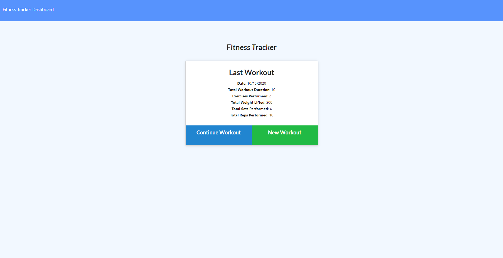
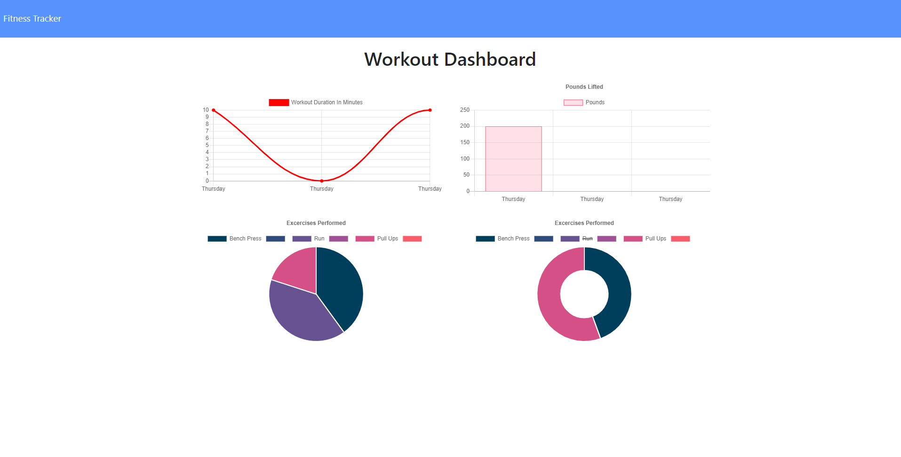

# Tracker of Workouts

## Description

This application will let you create and track workouts stored in a mongo noSQL database.

## Installation

This application does not require installation. It is deployed at https://shrouded-wave-91189.herokuapp.com/

## Usage

The user is presented with the to start a new workout or continue one if there is already one stored in the database. After creating the workout, they can then complete it. The fitness tracker at the top left of the page will display detailed information about previous workouts.

## Contributers

MongoDB
JS
HTML
CSS
Node
Mongoose
Express

## Tests

Trial and Error

## Questions

If you have any questions or suggestions, please contact me here:
[oscar.oses.1127@gmail.com](oscar.oses.1127@gmail.com)

## Images

